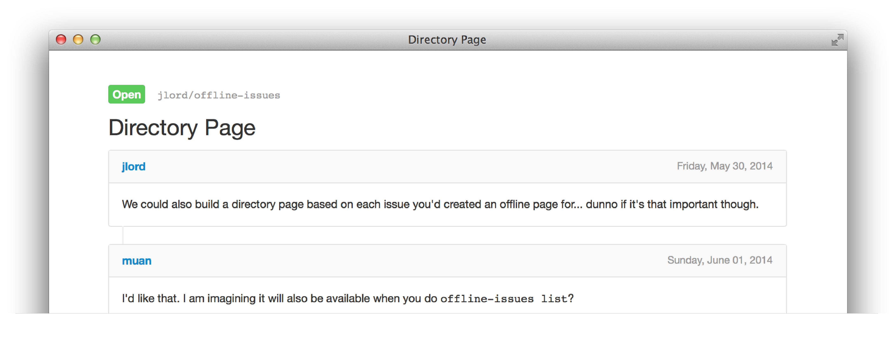

# offline-issues

[](http://standardjs.com/)

_Get your GitHub Issues offline! In Markdown and HTML._

This is a command line application, using [Node.js](http://nodejs.org/), that fetches the GitHub Issue/s you specify and writes them to files on your computer in both HTML and markdown formats. This way you can view them without an internet connection.

**This will cap issues at the first 250.**



## To Use

- Have [Node.js](http://nodejs.org/) installed on computer.
- From your command line, install this module `npm install -g offline-issues`
- Authorize it by running `offline-issues` and following the commands.
- Use it to save Issues as `.md` and `.html`. Options in next section.

### Command Line Interface (CLI)

For one issue:

```bash
$ offline-issues USER/REPO#0
```

For all issues:

```bash
$ offline-issues USER/REPO
```

For multiple repositories or issues:

```bash
$ offline-issues USER/REPO USER/REPO#0
```

**Example:**

```bash
$ offline-issues jlord/offline-issues muan/github-gmail#4
```

The files are written to whichever directory you are currently in. You will see a `md` and `html` folder added, each of which contains the issues you requested.

## Options

To just generate HTML files from existing offline cache:

```bash
$ offline-issues -h
$ offline-issues --html
```

To skip generating static files for HTML:

```bash
$ offline-issues -S USER/REPO
$ offline-issues --no-static USER/REPO
```

To save generated files in different location:

```bash
$ offline-issues -d DIRECTORY USER/REPO
$ offline-issues --destination DIRECTORY USER/REPO
```

To filter by issue state:

```bash
$ offline-issues -s all USER/REPO
$ offline-issues --state all USER/REPO
```

This option accepts either ```open```, ```closed``` or ```all```. (Default: ```open```)
Note that the filter won't be applied when issue number is specified, like ```muan/github-gmail#4```.


## Build / Develop Locally

- Clone this repository: `git clone https://github.com/jlord/offline-issues.git`
- Go inside this project: `cd offline-issues`
- Install dependencies: `npm install`
- Link this local version to your global `npm link` (or `sudo npm link`)
- If you have trouble with this or don't want to override the published version (this one) you can run it through the path to the main file: `<path-to-clone>/src/cli.js OPTIONS`
- On Ubuntu, use `nodejs <path-to-clone>/src/cli.js` (or `nodejs $(which offline-issues)`) to start the CLI

---

## Future times

Currently working at MVP level -- it gives you the issues you specify. But I want to add (or recieve Pull Requests!) to it:

- More command line options like getting 'all' or 'closed' or 'open' or by 'author' or 'mention'.
- Directory/Index of files you have.
- Tests.
- Spin up server.
- Sync up the issues you currently have at a later date.
